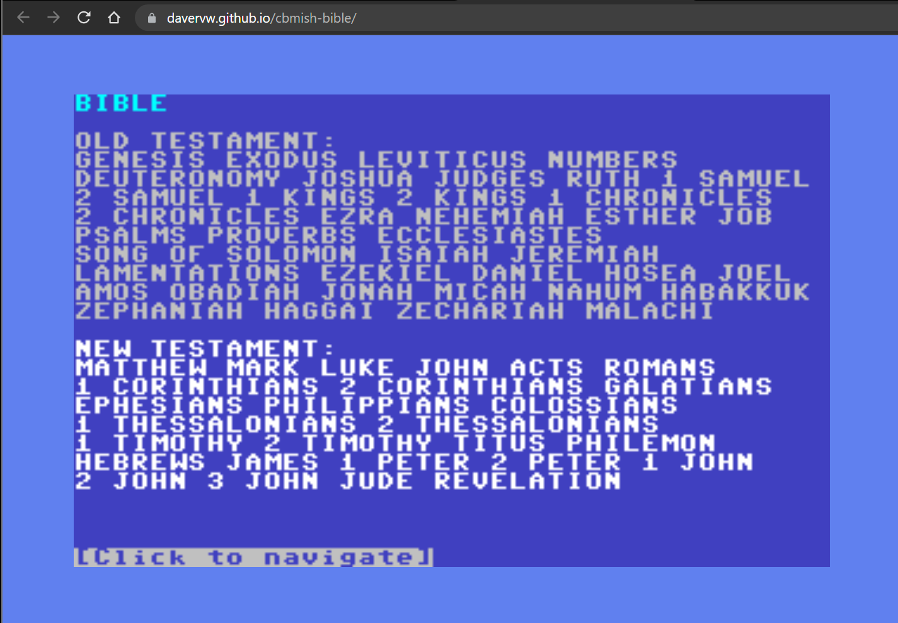
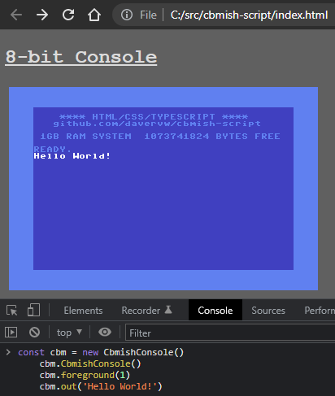

# cbmish-bible #

## About ##

Bible navigation hosted in an 8-bit familiar user interface.  Forked from [cbmish-script](https://github.com/davervw/cbmish-script)

* Bible is original King James Version translated in 1611
* CbmishConsole is a TypeScript class that in conjunction with HTML/CSS provides a C64 appearance screen which can be used to output strings, handle mouse clicks, etc.  Methods are provided to adjust colors, output an object (that is converted to string), and even poke to color and screen memory if that's your thing.
* No BASIC is provided, you are expected to code in your own JavaScript.   Empty sample.ts is provided, otherwise use your browser's developer tools to code interactively.

## Live Trial ##

Hosted at github.io: [Live Trial](https://davervw.github.io/cbmish-bible/?scale=3)

## Build ##

To build the JavaScript .js files referenced by index.html, use tsc (TypeScript compiler), available via npm, and can run in the background.  I send to a separate directory for use with GitHub Pages.

    tsc --outDir docs --watch

## Sample ##

Sample usage from developer tools console:

    const cbm = new CbmishConsole()
    cbm.CbmishConsole()
    cbm.foreground(1)
    cbm.out('Hello World!')
